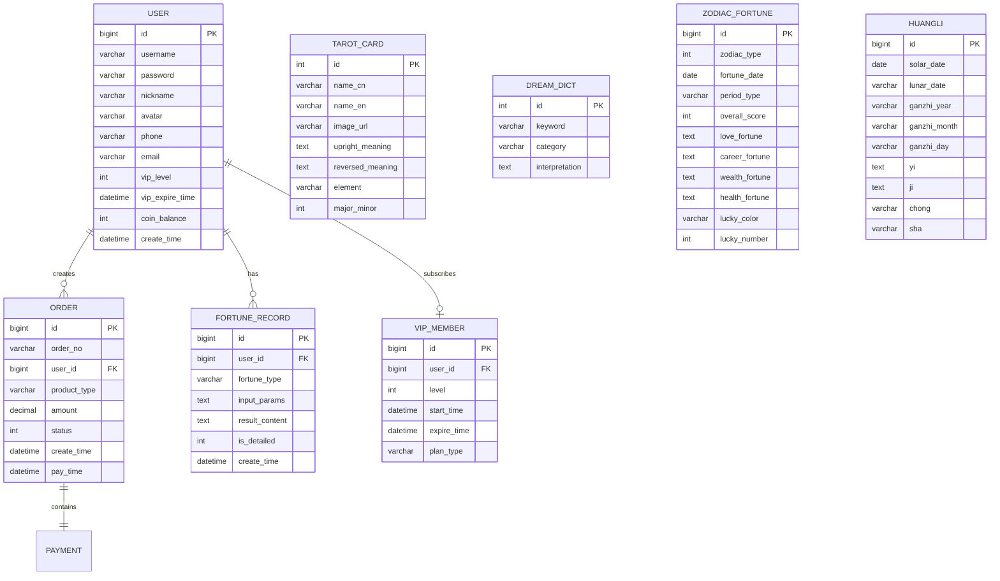

# 算命商业平台 - 全栈项目计划

## 项目结构

```
DayByDay/
├── fortune-backend/          # Spring Boot 后端
│   ├── src/main/java/com/fortune/
│   │   ├── config/           # 配置类（安全、跨域、Swagger等）
│   │   ├── controller/       # 控制器层
│   │   ├── service/          # 业务逻辑层
│   │   ├── mapper/           # MyBatis Mapper层
│   │   ├── entity/           # 实体类
│   │   ├── dto/              # 数据传输对象
│   │   ├── vo/               # 视图对象
│   │   ├── common/           # 通用工具类、常量、枚举
│   │   ├── algorithm/        # 算命核心算法
│   │   │   ├── bazi/         # 八字算法
│   │   │   ├── zodiac/       # 星座算法
│   │   │   ├── tarot/        # 塔罗牌算法
│   │   │   ├── naming/       # 姓名测算算法
│   │   │   ├── dream/        # 解梦逻辑
│   │   │   ├── fengshui/     # 风水算法
│   │   │   └── calendar/     # 黄历算法
│   │   └── exception/        # 全局异常处理
│   └── src/main/resources/
│       ├── application.yml
│       ├── mapper/           # MyBatis XML映射
│       └── data/             # 初始化数据（梦境词典、塔罗牌数据等）
├── fortune-frontend/         # Vue2 前端
│   ├── src/
│   │   ├── api/              # 接口调用
│   │   ├── assets/           # 静态资源
│   │   ├── components/       # 公共组件
│   │   ├── views/            # 页面
│   │   ├── router/           # 路由
│   │   ├── store/            # Vuex状态管理
│   │   └── utils/            # 工具函数
│   └── public/
└── sql/                      # 数据库脚本
    └── init.sql
```

## 技术栈

### 后端

- **框架**: Spring Boot 2.7.x
- **ORM**: MyBatis-Plus 3.5.x
- **安全**: Spring Security + JWT
- **数据库**: MySQL 8.0
- **缓存**: 内存缓存（ConcurrentHashMap，避免额外Redis依赖）
- **文档**: Swagger/Knife4j
- **工具**: Lombok, Hutool

### 前端

- **框架**: Vue 2.6 + Vue Router + Vuex
- **UI库**: Element UI 2.x
- **HTTP**: Axios
- **图表**: ECharts（五行图表、运势趋势图）
- **样式**: SCSS + 中国风自定义主题

## 数据库设计 (核心表)



## 8大功能模块设计

### 1. 八字算命模块

- **输入**: 出生年月日时、性别
- **输出**: 天干地支排盘、五行比例图表、十神分析、大运排列、流年运势、性格分析、事业/财运/婚姻建议
- **算法**: 基于万年历推算天干地支，根据日主强弱判断喜用神
- **免费/付费**: 基础排盘免费，详细解读需VIP或单次付费

### 2. 星座运势模块

- **功能**: 12星座每日/每周/每月运势、星座配对、星座性格详解
- **展示**: 运势评分雷达图、趋势折线图
- **数据**: 后台管理员可编辑运势内容，支持批量生成

### 3. 塔罗牌占卜模块

- **牌阵**: 单张牌、三张牌（过去/现在/未来）、凯尔特十字牌阵
- **交互**: 洗牌动画、翻牌效果、正逆位随机
- **解读**: 78张标准塔罗牌完整数据，含正位/逆位含义

### 4. 姓名测算模块

- **算法**: 五格剖象法（天格、人格、地格、外格、总格）
- **输出**: 五格数理吉凶、三才配置、姓名评分、建议用字
- **扩展**: 起名推荐功能

### 5. 周公解梦模块

- **功能**: 关键词搜索、分类浏览（动物、植物、人物、自然等）
- **数据**: 内置1000+梦境词条
- **展示**: 搜索结果高亮、相关梦境推荐

### 6. 面相手相模块

- **功能**: 上传照片获取面相/手相分析报告
- **实现**: 后端基于预设特征点的规则引擎分析（简化版，非AI识别）
- **输出**: 面部五官分析、手掌主要纹路解读

### 7. 风水分析模块

- **功能**: 罗盘方位选择、家居风水布局建议、办公室风水
- **交互**: 可视化罗盘组件、方位选择器
- **输出**: 各方位吉凶分析、改善建议

### 8. 老黄历模块

- **功能**: 日历视图、每日宜忌、吉时查询、节气显示
- **数据**: 农历转换、干支纪年、二十四节气
- **交互**: 日历翻页、日期选择详情

## 用户与支付体系

### 用户系统

- 手机号/邮箱注册登录
- JWT Token 无状态认证
- 用户中心（个人信息、历史记录、收藏）

### 会员等级

- **普通用户**: 每日3次免费基础测算
- **月度VIP (29.9元)**: 无限基础测算 + 每月5次详细解读
- **年度VIP (199元)**: 全部功能无限使用
- **积分/金币**: 可通过签到、分享获取，用于兑换单次详细解读

### 支付流程（模拟）

- 订单创建 -> 选择支付方式 -> 模拟支付回调 -> 开通权限
- 支持微信/支付宝支付接口预留（本次用模拟接口）

## 后台管理

- 用户管理（查看、禁用、VIP调整）
- 内容管理（星座运势编辑、梦境词典维护、塔罗牌管理）
- 订单管理（订单列表、退款处理）
- 数据统计（用户增长、收入趋势、功能使用排行）
- 系统设置（价格配置、功能开关）

## 前端页面设计

- **首页**: 功能入口轮播 + 热门推荐 + 每日运势速览
- **各功能页**: 独立的输入表单 + 结果展示页
- **用户中心**: 个人信息、测算历史、会员管理、金币明细
- **支付页**: 会员套餐选择、订单确认、支付结果
- **后台管理**: 独立的admin路由，表格+表单为主
- **整体风格**: 中国风配色（深红/金色/墨色），典雅大气

## 实施顺序

按模块依赖关系分阶段实施，后端和前端同步推进。